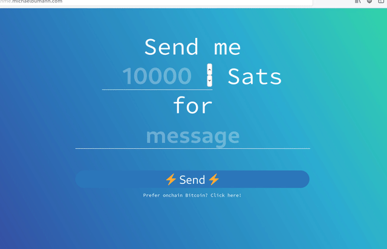

<p align="center"><br/><br/><br/><br/></p>
<h1 align="center">LnMe - your friendly payment page</h1><br/><br/>

LnMe is a personal Bitcoin Lightning payment page/widget and self-hosted [Lightning Address](https://lightningaddress.com/) server.



**See it in action: [ln.michaelbumann.com](http://ln.michaelbumann.com/) - my lightning address: bumi@ln.michaelbumann.com**

LnMe focusses on simplicity and ease of deployment. It connects to an existing lightning node (currently LND is supported).

LnMe is one [simple executable](https://github.com/bumi/lnme/releases) file that can be deployed anywhere with no dependencies. (on your own node or for example with [one click on Heroku](#heroku))

## Features

- [x] Embeded payment page - customizable (see demo)
- [x] [Lightning Address](https://lightningaddress.com/) support
- [x] WebLN integration - if [WebLN](https://webln.dev/) is not available a QRcode and the invoice will be shown
- [x] [JavaScript widget](#javascript-widget-integration) for existing websites
- [x] [Invoice API](https://github.com/bumi/lnme/wiki/API) - simple REST API to create LN invoices from existing JS code
- [x] [LNURL-pay](https://github.com/fiatjaf/lnurl-rfc/blob/luds/06.md) support
- [x] [LNURL-pay comment](https://github.com/fiatjaf/lnurl-rfc/blob/luds/12.md) support

## Installation

LnMe connects to your [LND node](https://github.com/lightningnetwork/lnd/blob/master/docs/INSTALL.md), so a running LND node is required.
LnMe can easily run next to LND on the same system or any other hosting provider.

There are no other dependencies. Simply download the binary and run it!

1. Download the latest [release](https://github.com/bumi/lnme/releases)
2. Run `lnme`
3. Done.

### Build from source

1. `$ git clone https://github.com/bumi/lnme.git && cd lnme`
2. `$ go install`
3. `$ go build`
4. `$ ./lnme`

### Running in Docker

LnMe is now available in docker too.
You can start LnMe like this: `docker run -it --rm ghcr.io/bumi/lnme:master`
A list of existing tags is available [here](https://github.com/bumi/lnme/pkgs/container/lnme).

### Configuration

#### LND configuration

To connect to the lnd node the cert, macaroon and address of the lnd node has to be configured. LnMe uses the LND defaults.

- `lnd-address`: Host and port of the LND gRPC service. default: localhost:10009
- `lnd-cert-path`: Path to the LND TLS cert file. default: ~/.lnd/tls.cert
- `lnd-macaroon-path`: Path to the LND macaroon file. default: ~/.lnd/data/chain/bitcoin/mainnet/invoice.macaroon (invoice.macaroon is recommended)

Instead of the path to the macaroon and cert files you can also provide the hex strings:

- `lnd-cert`: LND TLS cert as HEX string.
- `lnd-macaroon`: LND macaroon HEX string. (invoice.macaroon is recommended)

#### Other configuration

- `static-path`: Path to a folder that you want to serve with LnMe (e.g. /home/bitcoin/lnme/website). Use this if you want to customize your ⚡website. default: disabled
- `lnurlp-comment-allowed`: Allowed length of LNURL-pay comments, maximum around [~2000 characters](https://stackoverflow.com/a/417184). (default: 210)
- `disable-website`: Disable the default LnMe website. Disable the website if you only want to embed the LnMe widget on your existing website.
- `disable-cors`: Disable CORS headers. (default: false)
- `disable-ln-address`: Disable [Lightning Address](https://lightningaddress.com/) handling.
- `port`: Port to listen on. (default: 1323)
- `request-limit`: Limit the allowed requests per second. (default: 5)

Depending on your deployment needs LnMe can be configured using the following options:

1. Command line flags
2. Environment variables
3. Config TOML file

#### Examples:

##### Command line flags:

    $ lnme --help
    $ lnme --lnd-address=lndhost.com:10009 --port=4711
    $ lnme --disable-website

##### TOML config file

See [config.toml.example](./toml.config.example) for an example file.

    $ lnme --config=/path/to/config.toml

##### Environment variables

All environment variables must be prefixed by `LNME_` use `_` instead of `-`

    $ LNME_LND_ADDRESS=127.0.0.1:10005 lnme

### LND Permissions

LnMe needs the following LND permissions:

- Read/Write permission for `invoices`
- Write permission for `address` (if you want to use the onchain option)

Use the LND [macaroon bakery](http://macaroon-bakery.freedomnode.com/) to create a new macaroon for LnMe.

To get the HEX versions of the files use `xxd -plain` e.g. `xxd -plain invoice.macaroon | tr -d '\n'`

### TOR

LnMe can connect to your lightning node through [Tor](https://www.torproject.org/). You need to have Tor installed on your system and then simply provide your LND `.onion` address (don't forget to specify the port).

## Deployment

It is the easiest to run LnMe on the same node as LND. But you can run it anywhere as long as your LND node is accessible. Simply run the binary and make sure the PORT is accessible.

If you run LNMe on a different server you will need your LND address, the LND TLS certificate (HEX) and the macaroon (HEX). (see above)

When getting the HEX of the LND files use `xxd -plain YOUR_FILE.cert | tr -d '\n'`. For example for the TLS certificate, use `xxd -plain tls.cert | tr -d '\n'`.

The TLS cert is located in the lnd directory:

- ~/umbrel/lnd/tls.cert on Umbrel
- /mnt/hdd/lnd/tls.cert on Raspiblitz
- Can also be located in ~/.lnd

You should find the macaroon files in the LND data dir (e.g. ~.lnd/data/chain/bitcoin/mainnet/) or see "LND Permissions" how to create a new one.

### Heroku

One click deployment with Heroku:

[](https://heroku.com/deploy?template=https://github.com/bumi/lnme)

Here is a [Video Demo of the Heroku deployment](https://www.youtube.com/watch?v=hSFXhnLp_Rc)

In order to run Tor on Heroku, the Heroku deployment includes a non-official buildpack: https://github.com/iamashks/heroku-buildpack-tor-proxy
This buildpack can be disabled and removed if not needed or desired, through the Settings tab on the Heroku dashboard, or by editing app.json and removing the buildpack.

Lastly, using the Heroku deployment, you can link the app to your own domain by following the directions here: https://help.heroku.com/MTG1BIA7/how-do-i-connect-a-domain-to-my-heroku-app

### Deployment Notes

To run LnMe as systemd service have a look at the [systemd service example config](https://github.com/bumi/lnme/blob/master/examples/lnme.service)

I am running LnMe behind a reverse proxy using [caddy](https://caddyserver.com/) which comes with [fully-managed HTTPS](https://caddyserver.com/docs/quick-starts/https) via [letsencrypt](https://letsencrypt.org/).

Example Caddyfile:

```
lnme.michaelbumann.com {
  reverse_proxy 127.0.0.1:1323
}
```

`$ caddy --config /etc/caddy/Caddyfile`

## Feature Usage

### Lightning Address

The Lightning Address is an Internet Identifier that allows anyone to send you Bitcoin over the Lightning Network.
Lightning Address builds on [LNURL-pay](https://github.com/fiatjaf/lnurl-rfc/blob/luds/06.md) LnMe handles the necessary requests for you.

For more information check out the website: [lightningaddress.com](https://lightningaddress.com/)

Your Lightning Address: `{anything}@{your domain}`

### LNURL

if you got the Lightning Address enabled you also get a LNURL-pay URL:

https://`{your domain}/lnurlp/{anything}`

If you need an bech32 encoded version you can use this online tool: [https://lnurl.fiatjaf.com/codec/](https://lnurl.fiatjaf.com/codec/) 

### Customize your ⚡ website

LnMe comes with a default website but you can easily configure and build your own using the the LnMe JavaScript widget or JSON API.

Take a look at the [embedded default website](https://github.com/bumi/lnme/blob/master/files/root/index.html) for an example and use the `--static-path` option to configure LnMe to serve your static file.

1. Create a new folder (e.g. /home/satoshi/my-ln-page)
2. Create your index.html
3. Run lnme: `lnme --static-path=/home/satoshi/my-ln-page

### Usage with 21 Payment Widgets

[widgets.twentyuno.net](https://widgets.twentyuno.net/) is a beautiful embeddable payment widget for any existing website.  
You can use your LnMe instance with the widget by using your [LnMe LNURL](https://github.com/bumi/lnme#lnurl) with the widget. 

Use your bech32 encoded [LNURL](https://github.com/bumi/lnme#lnurl) as `Receiver` in the [widget configuration](https://widgets.twentyuno.net/get-started)

### JavaScript Widget integration

You can integrate the LnMe widget in your existing website.

#### 1. Add the LnMe JavaScript files

```html
<script
  data-lnme-base-url="https://your-lnme-host.com:1323"
  src="https://your-lnme-host.com/lnme/lnme.js"
></script>
```

#### 2. Usage

To request a lightning payment simply call `request()` on a `new LnMe({value: value, memo: memo})`:

```js
var lnme = new LnMe({ value: 1000, memo: "high5" });
lnme.request();
```

Use it from a plain HTML link:

```html
<a
  href="#"
  onclick="javascript:new LnMe({ value: 1000, memo: 'high5' }).request();return false;"
  >Tip me</a
>
```

##### More advanced JS API:

```js
let lnme = new LnMe({ value: 1000, memo: "high5" });

// get a new invoice and watch for a payment
// promise resolves if the invoice is settled
lnme.requestPayment().then((invoice) => {
  alert("YAY, thanks!");
});

// create a new invoice
lnme.addInvoice().then((invoice) => {
  console.log(invoice.PaymentRequest);
});

// periodically watch if an invoice is settled
lnme.watchPayment().then((invoice) => {
  alert("YAY, thanks!");
});
```

## Motivation

I wanted a simple way for people to send Lightning payments using my own lightning node.
BTCPay Server is too big and hard to run for that and I do not need most of its features.

## Development

Use `go run` to run the service locally:

    $ go run lnme.go --address=127.0.0.1:10009 --cert=/home/bitcoin/lightning/tls.cert --macaroon=/home/bitcoin/lightning/invoice.macaroon

## Build

    $ go build

## Contributing

Bug reports and pull requests are welcome on GitHub at https://github.com/bumi/lnme

## Support

If you like this software and it is valuable for you, you can send sats to ⚡️bumi@getalby.com

## License

Available as open source under the terms of the [MIT License](http://opensource.org/licenses/MIT).
